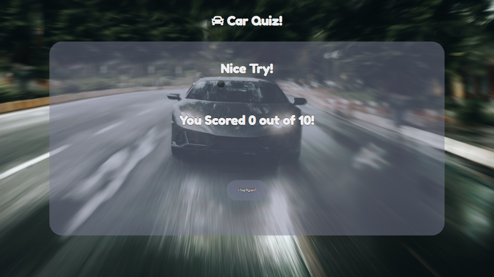

# **Car Quiz**

insert image here

You can see the live website [here](https://browne878.github.io/Car-Quiz-PP2/).

The purpose of this website to provide the user with a fun and challenging game to test their knowledge of cars.

My aim for this quiz was to make a simple and easy to use UI that allows the user to focus on the game. I wanted to be able to randomise the questions so the user can play multiple times. Finally, I wanted this website to be responsive, so that users on all devices can enjoy the completed website.

## **Table of Contents**
- ### [Features]()
    - [Welcome Screen]()
    - [Question Screen]()
    - [Game Over Screen]()

- ### [Future Development]()

- ### [Testing]()
    - [Lighthouse]()
    - [HTML Validator]()
    - [CSS Validator]()

- ### [Bugs]()
    - [Unfixed Bugs]()
    - [Fixed Bugs]()

- ### [Deployment]()
    - [Cloning/Forking Repository]()
    - [Local Deployment]()
    - [Remote Deployment]()

- ### [Credits]()

## **Features**

- ### **Welcome Screen**
    - The purpose of this page is to give the player an understanding of how to play the game and give them an idea of what to expect.
    - I wanted this page to be clean and easy to read. I inteded to make it easy to navigate to allow the user to behin playing.


- ### **Question Screen**
    - I wanted the question and options to be easily readable. I also wanted it to be clear on how to play.
    - I incuded a timer and progress bar to ensure the player has enough time to read the question and answer it.


- ### **Game Over Screen**
    - I wanted this page to display the score the player achieved throughout the game.
    - I didn't want too much information on this page as the user now understands how the game works.
    - I also wanted the user to have the option to play the game again without reloading the page.


## **Future Development**

## **Testing**

### **Lighthouse**

During the development of the quiz, I used the lighthouse to monitor my progress. I used it to ensure that everything added performed as intended. I also used it to ensure that I was following best practices and accessibility guidelines.

By doing this throught the development process I was able to ensure that there were no issues with my lighthouse score.

Mobile Score: Full report can be found [here](assets/lighthouse/mobile.pdf)


Desktop Score: Full report can be found [here](assets/lighthouse/desktop.pdf)


### **HTML Validator**

Once I had completed the website, I entered my HTML code into the [W3C Markup Validation Service](https://validator.w3.org/). The results can be found by clicking [here](assets/images/html-validator.png)

### **CSS Validator**

### **JSHint Validator**

Once I completed the quiz, I entered all of my JS code into the [JSHint Javascript Validator](https://jshint.com/). There is only two warnings, one is an underfined variable in the script.js file, the other is a unused variable in the questions.js file. This is due to the questions.js file being seperated to keep the files easy to read. Each file is loaded and the unused variable is defined globally, allowing it to be used by the script.js file.

The screenshot of the report for the script.js file can be found [here](assets/images/jshint-script.png).
The screenshot of the report for the questions.js file can be found [here](assets/images/jshint-questions.png).

## **Bugs**

### Unfixed Bugs

There is currently one existing bug I am working on resolving. This bug occurs every time the game is played again after completing one round. After a random number of questions, once the timer is up, the options to answer the question will not be made visible. This can be bypassed by refreshing the page, however this is not a perminant fix.

If you are able to see what the issue causing this bug could be, please feel to reach out to me as it would be greatly appretiated.

### Fixed Bugs

While making the progress bar, I ran into a bug where the progress bar would work once and not reset. This was because I was unable to make the animation restart. In order to fix this, in the js, I cloned the progress bar and replace it each time the progress bar is meant to reset. This means that each time the progress bar restarts, it is a new instance of itself and begins the progress over again.

Another bug I encountered during development was that when you play again, you would then face the 10 questions that were just played, as well as another 10 added on to the end. In order to fix this, every time the beginGame functions is called, the array will be cleared. This resolves this issue.

## **Deployment**

### Cloning / Forking Repository

In order to Fork the Repository, please follow the instructions below.
 1. Navigage to [this](https://github.com/browne878/Car-Quiz-PP2) repository.
 2. Next, in the top left of the page, click the fork button.
 3. If you are a member of a team, you may need to choose where to Fork the repository too.

Once you have forked the Repository, you can then clone it to your local machine. To do so, please follow the instructions below.
 1. Navigate to your Forked repository.
 2. Click the green Code button above the repositories files.
 3. Copy the URL in the dropdown window.
 4. Next, open command prompt.
 5. After this, navigate to the directory you would like to clone the repository too with the following command.
 ```
cd <clone location>
 ```
 6. Then, run the following command.
 ```
git clone <URL>
 ```

You have now forked and cloned the repository.

### Local Deployment

These instructions will tell you how to deploy the repository on your local machine with VSCode and the extension [Live Server](https://marketplace.visualstudio.com/items?itemName=ritwickdey.LiveServer). Please ensure you have VSCode and the Live Server extension installed before beginning the following steps.

1. First, follow the steps for Cloning and Forking the repository so you have the repository locally.
2. Open the folder with VSCode by doing one of the following:
    - Right click the file and click `Open with Code`
    - Open command prompt, navigate inside the directiory and run the command `code .`
    - Open VSCode, click file, open folder and then navigate to the repository folder and open it.
3. Next, at the very bottom of the window, there will be a button that says `Go Live`. Click this button and it will deploy it locally and open it in your default browser for you to view.

### Remote Deployment

I deployed this website using GitHub Pages. The steps I took to do this are as follows.

1. Start by navigating to the GitHub repository.
2. Next, towards the top of the page, navigate to the `Settings` tab.
3. After this, on the menu of the left of the page, click on the `Pages` tab.
4. Now, click the `Branch` dropdown menu and select `Main` or whatever the name of your main branch is.
5. Finally, wait for the site to be published. This can take a few moments. The link will be shown at the top of the page.

The link to my published website is: https://browne878.github.io/Car-Quiz-PP2/

## **Credits**
[Background Image](assets/images/race-background.jpg) downloaded from [Pexels](https://www.pexels.com/photo/grey-coupe-on-road-3136673/).

[Timer Function](https://css-tricks.com/how-to-create-an-animated-countdown-timer-with-html-css-and-javascript/) was taken and adapted for the timer and progress bar.